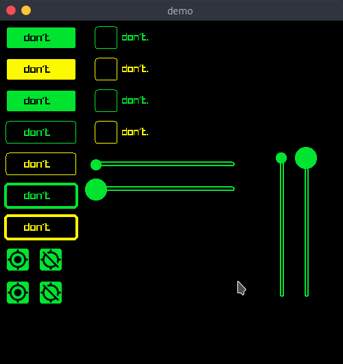

# ruicf
### `'るいけえ' (hella nice ui controls)`

notice

this is greek

notice

i know for sure

 

## TL;DR
Features:
- [X] The goodness of [raylib](https://github.com/raysan5/rayylib)
- [X] The greatness of material style

Controls:
- [X] Button
  - [X] Filled
  - [X] Outline
  - [X] Image
  - [ ] Dropdown
- [X] Checkbox
- [X] Slider
    - [ ] SliderKnob with image
- [ ] ListView
- [ ] Spinner

Usage:
1. Put ruicf.h in your project
2. Profit

## Show and tell
